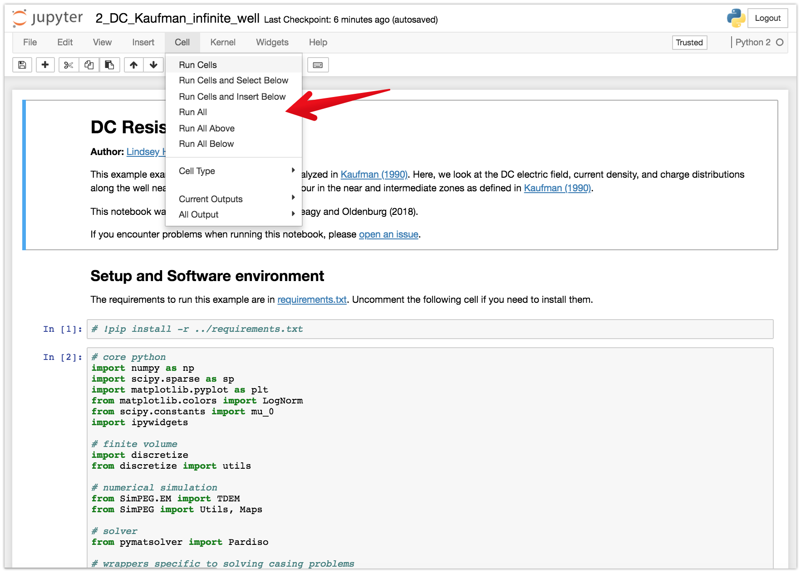

**| [Overview](#overview) | [Launching the notebooks](#launching-the-notebooks) | [Running the notebooks](#running-the-notebooks) | [Citation](#citation) | [Issues](#issues) | [License](#license) |**

# Detecting induced polarization effects in time-domain data: a modeling study using stretched exponentials


## Overview
This repository contains the notebooks used to generate the examples shown in "Detecting induced polarization effects in time-domain data: a modeling study using stretched exponentials" by [Seogi Kang](https://github.com/sgkang), [Lindsey J. Heagy](https://github.com/lheagy), [Douglas W. Oldenburg](https://github.com/dougoldenburg).

This collection of notebooks will first illustrates physics of induced polarization (IP) effects in airborne time-domain electromagnetic data, and then investigate under what conditions airborne IP can detect chargeable bodies at depth. The list of the notebooks are:

- [notebooks](notebooks): contains the notebooks used to generate figures in the paper and thesis
    - [1-Fit-ColeCole-with-StrecthedExponential.ipynb](notebooks/1-Fit-ColeCole-with-StrecthedExponential.ipynb):
        - Figure 1
    - [2-Understand-Physics](notebooks/2-Understand-Physics.ipynb):
        - Figure 2, 3, 4
    - [3-Background-conductivity](notebooks/3-Background-conductivity.ipynb):
        - Figures 5, 6
    - [4-Depth-of-burial](notebooks/4-Depth-of-burial.ipynb):
        - Figures 7, 8, 9, 10
    - [5-Target-size](notebooks/5-Target-size.ipynb):
        - Figures 11, 12
    - [6-Polarization-character](notebooks/6-Polarization-character.ipynb):
        - Figures 13, 14
    - [A1-Convolution](notebooks/A1-Convolution.ipynb)
        - Figure A1
    - [A2-Accuracy-Test](notebooks/A2-Accuracy-Test.ipynb)
        - Figure A2
    - [A3-Triple-Peak](notebooks/A3-Triple-Peak.ipynb)
        - Additional notebook prompted in AEM workshop 2018; this shows four sign reversals!


## Launching the notebooks

### Online
The notebooks can be run online through [mybinder](https://mybinder.org/v2/gh/simpeg-research/kang-2018-AEM/master?filepath=notebooks%2Findex.ipynb)

### Locally
To run them locally, you will need to have python installed, preferably through [anaconda](https://www.anaconda.com/download/).

You can then clone this repository. From a command line, run

```
git clone https://github.com/simpeg-research/kang-2018-AEM.git
```

Then `cd` into the `kang-2018-AEM`

```
cd kang-2018-AEM
```

To setup your software environment, we recommend you use the provided conda environment

```
conda env create -f environment.yml
source activate aemip-environment
```

alternatively, you can install dependencies through pypi
```
pip install -r requirements.txt
```

You can then launch Jupyter
```
jupyter notebook
```

Jupyter will then launch in your web-browser.

## Running the notebooks

Each cell of code can be run with `shift + enter` or you can run the entire notebook by selecting `cell`, `Run All` in the toolbar.



For more information on running Jupyter notebooks, see the [Jupyter Documentation](https://jupyter.readthedocs.io/en/latest/)

## Citation

Kang, S., & Oldenburg, D. W. (2019). Inversions of time-domain spectral induced polarization data using stretched exponential.

```
@article{kang2018,
author = {Kang, Seogi, Heagy, Lindsey J, and Oldenburg, Douglas W},
journal = {Exploration Geophysics},
number = {},
pages = {},
title = {{Detecting induced polarization effects in time-domain data: a modeling study using stretched exponentials}},
volume = {},
year = {2019}
}
```

## Issues

If you run into problems or bugs, please let us know by [creating an issue](https://github.com/simpeg-research/kang-2018-AEM/issues/new) in this repository.

## License

These notebooks are licensed under the [MIT License](/LICENSE) which allows academic and commercial re-use and adaptation of this work.

## Version

Version: 0.0.1
